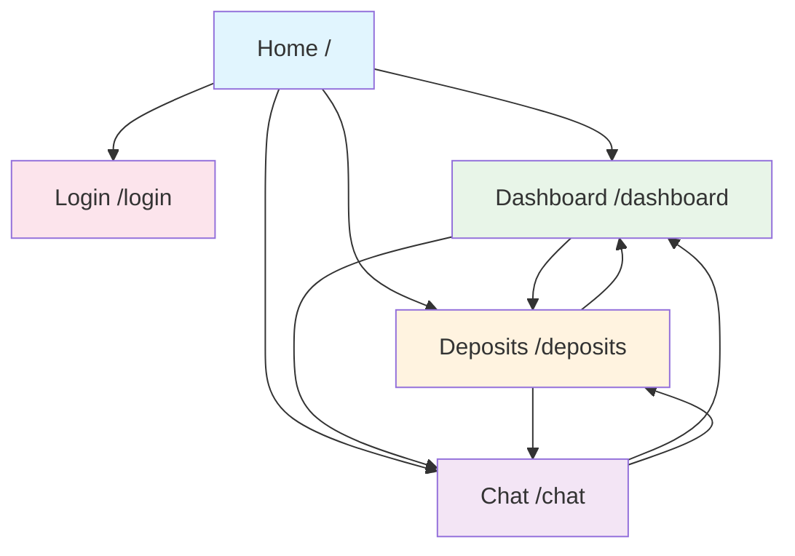

# Route Navigation Diagram

## Route Descriptions

- **Home /** - Main navigation hub (Light Blue)
- **Login /login** - Authentication page (Light Pink)
- **Dashboard /dashboard** - Overview statistics (Light Green)
- **Deposits /deposits** - Transaction management (Light Orange)
- **Chat /chat** - Customer support interface (Light Purple)

All protected routes (Dashboard, Deposits, Chat) share the same navigation components:
- Top navigation bar
- Side navigation menu

Users can navigate freely between protected routes using either navigation component.